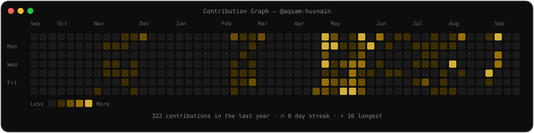

<h3><code>Aqsam Husnain</code></h3>

<table>
  <tr>
    <td>
      
    </td>
    <td>
      
    </td>
  </tr>
</table>

---

  

  
  &nbsp;
  
  &nbsp;
  

  

---

<h3><code>📊 Contributions</code></h3>

  

---

<h3><code>🚀 Featured Projects</code></h3>

<table>
  <tr>
    <td width="50%" valign="top">
      <h4><a href="https://github.com/aqsam-husnain/nexus-ai-studio">⚡ Nexus AI Studio</a></h4>
      
Multi-model generative AI workbench — compare GPT-4, Claude & LLaMA responses side-by-side with custom parameter controls and token cost estimation.

      
  

    </td>
    <td width="50%" valign="top">
      <h4><a href="https://github.com/aqsam-husnain/ats-resume-scanner">📄 ATS Resume Scanner</a></h4>
      
AI-powered resume evaluation engine with ATS compatibility scoring, keyword density analysis & actionable rewrite suggestions.

      
  

    </td>
  </tr>
  <tr>
    <td width="50%" valign="top">
      <h4><a href="https://github.com/aqsam-husnain/webcraft-saas-builder">🏗️ WebCraft SaaS Builder</a></h4>
      
Multi-tenant drag-and-drop website builder with Stripe subscriptions, subaccount management & custom domain routing.

      
  

    </td>
    <td width="50%" valign="top">
      <h4><a href="https://github.com/aqsam-husnain/codeforge-web-ide">💻 CodeForge Web IDE</a></h4>
      
In-browser code editor & compiler sandbox with Monaco Editor, multi-language syntax highlighting & real-time execution.

      
  

    </td>
  </tr>
  <tr>
    <td width="50%" valign="top">
      <h4><a href="https://github.com/aqsam-husnain/vortex-3d-storefront">🌀 Vortex 3D Storefront</a></h4>
      
High-performance 3D e-commerce showcase built with Three.js & React Three Fiber featuring interactive GLTF model controls.

      
  

    </td>
    <td width="50%" valign="top">
      <h4><a href="https://github.com/aqsam-husnain/syncpad-collaborative-editor">✏️ SyncPad Editor</a></h4>
      
Real-time collaborative text & code editor powered by WebSockets with multi-cursor presence indicators & room-based sessions.

      
  

    </td>
  </tr>
  <tr>
    <td width="50%" valign="top">
      <h4><a href="https://github.com/aqsam-husnain/stockpulse-analytics">📈 StockPulse Analytics</a></h4>
      
Financial analytics platform with interactive candlestick charts, live ticker marquees & portfolio profit-loss tracking.

      
  

    </td>
    <td width="50%" valign="top">
      <h4><a href="https://github.com/aqsam-husnain/hyperlaunch-saas">🚀 HyperLaunch SaaS</a></h4>
      
Dark-themed SaaS marketing landing page with Framer Motion animations, glassmorphism UI & interactive pricing toggles.

      
  

    </td>
  </tr>
</table>

---

<h3><code>🛠️ Tech Arsenal</code></h3>

  <b>Frontend & 3D</b> 
  

  <b>Backend & Database</b> 
  

  <b>Mobile</b> 
  &nbsp;

  <b>Tools & DevOps</b> 
  

---

<h3><code>📌 What I'm Up To</code></h3>

| | |
|:---|:---|
| 🔭 **Currently Building** | AI-powered full-stack applications with Next.js, FastAPI & LLM integrations |
| 🌱 **Learning** | Advanced system design, distributed systems & cloud-native architectures |
| ⚡ **Fun Fact** | I debug with `console.log` and I'm not ashamed of it 😄 |

---

<h3><code>🏆 Achievements</code></h3>

  

---

<h3><code>📊 GitHub Stats</code></h3>

  
  &nbsp;
  

  

---

<h3><code>🔗 Connect With Me</code></h3>

  
  &nbsp;
  
  &nbsp;
  
  &nbsp;
  
  &nbsp;
  
  &nbsp;
  

  
   
  Scan to visit my portfolio

---

  

  ⚡ Built with passion in Punjab, Pakistan 🇵🇰

